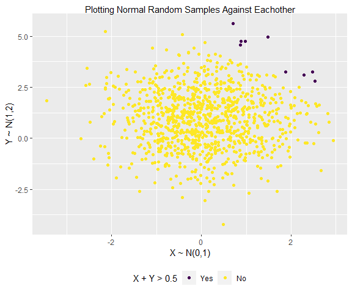
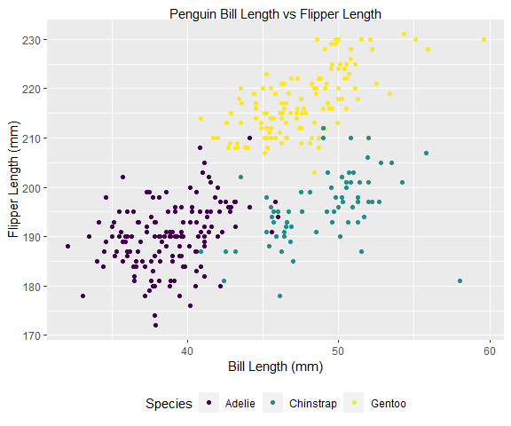
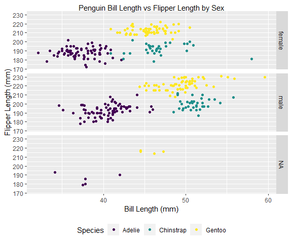

pubh7462_hw1_chri3744
================
Taylor Christian
1/29/2022

# Problem 2.1

``` r
#Creating tibble
hw1_tb <- tibble(
  x = rnorm(1000, mean = 0, sd = sqrt(1)),
  y = rnorm(1000, mean = 1, sd = sqrt(2)),
  sum_indicator = ifelse(x + y > 5, "Yes", "No")
)

#Converting sum_indicator to factor
hw1_tb <- mutate(hw1_tb, sum_indicator = as.factor(sum_indicator))

#Reordering the factor so Yes is before No
hw1_tb <- mutate(hw1_tb, sum_indicator = forcats::fct_relevel(sum_indicator, "Yes"))

#Creating ggplot
hw1_tb.gg <- hw1_tb %>%
  ggplot(aes(x = x, y = y, color = sum_indicator)) +
  geom_point()

#Displaying ggplot
hw1_tb.gg +
  #Labeling ggplot
  labs(x = "X ~ N(0,1)", y = "Y ~ N(1,2)", title = "Plotting Normal Random Samples Against Eachother") +
  #Adding legend title
  scale_colour_viridis_d("X + Y > 0.5")
```



# Problem 2.2

``` r
penguin.df <- read_rds("./data/penguin.RDS")
```

## Problem 2.2.1

### Case definition

Each row represents an observation of penguin species, Palmer
Archipelago island, size measurements(flipper length, body mass, and
bill dimensions), and sex.  

### Number of Observations

There were 344 observations made for this data.  

### Number of Variables/Features

There are 8 variables for each observation.  

### Meaning of Each Variable

**species**: a factor denoting penguin species (Adelie, Chinstrap, and
Gentoo).  
**island**: a factor denoting island in Palmer Archipelago, Antartica
(Biscoc, Dream, or Torgersen).  
**bill_length_mm**: a number denoting bill length (millimeters).  
**bill_depth_mm**: a number denoting bill depth (millimeters).  
**flipper_length_mm**: an integer denoting flipper length
(millimeters).  
**body_mass_g**: an integer denoting body mass (grams).  
**sex**: a factor denoting penguin sex (female, male).  
**year**: an integer denoting the study year (2007, 2008, or 2009).  

### Variable Means

#### Flipper length mean and SD

The observed mean flipper length is 200.92 and its SD is 14.06.

#### Bill length mean and SD

The observed mean flipper length is 43.92 and its SD is 5.46.

## Problem 2.2.2

``` r
#Creating ggplot
penguin.gg <- penguin.df %>%
  ggplot(aes(x = bill_length_mm, y = flipper_length_mm, color = species)) +
  geom_point()

#Displaying ggplot
penguin.gg +
  #Labeling ggplot
  labs(x = "Bill Length (mm)", y = "Flipper Length (mm)", title = "Penguin Bill Length vs Flipper Length") +
  #Adding legend title
  scale_colour_viridis_d("Species")
```



``` r
#Creating ggplot
penguin.gg <- penguin.df %>%
  ggplot(aes(x = bill_length_mm, y = flipper_length_mm, color = species)) +
  geom_point()

#Displaying ggplot
penguin.gg +
  #Labeling ggplot
  labs(x = "Bill Length (mm)", y = "Flipper Length (mm)", title = "Penguin Bill Length vs Flipper Length by Sex") +
  #Adding legend title
  scale_colour_viridis_d("Species") +
  #Splitting by sex
  facet_grid(vars(sex))
```



### Data Trends

From looking at the above plots, it can be seen that average bill length
is shorter in the Adelie penguins than in the other two species
observed. Additionally, average flipper length appears higher in the
observed Gentoo penguins than the other two species observed. In all
three species there appears to be a positive correlation between flipper
length and bill length. These trends appear to be preserved between the
sexes, with all 3 species showing higher apparent average bill length in
males.
